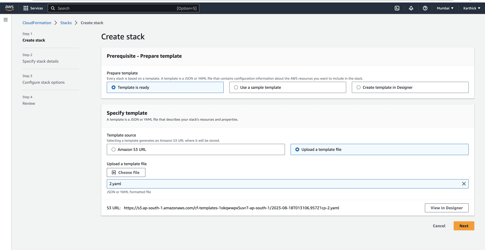
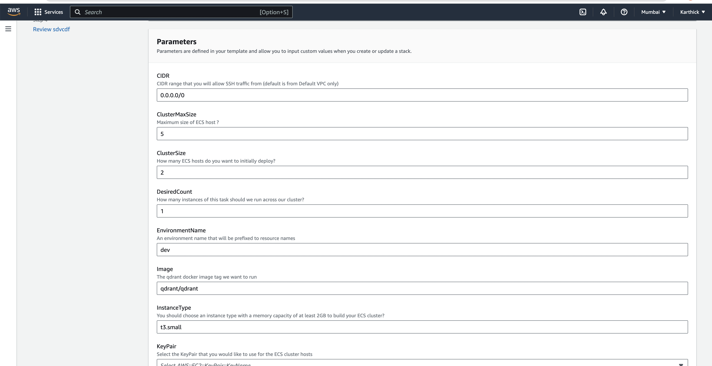
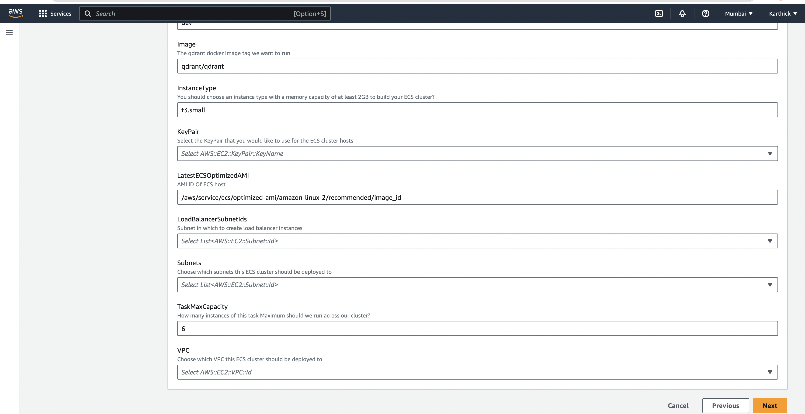
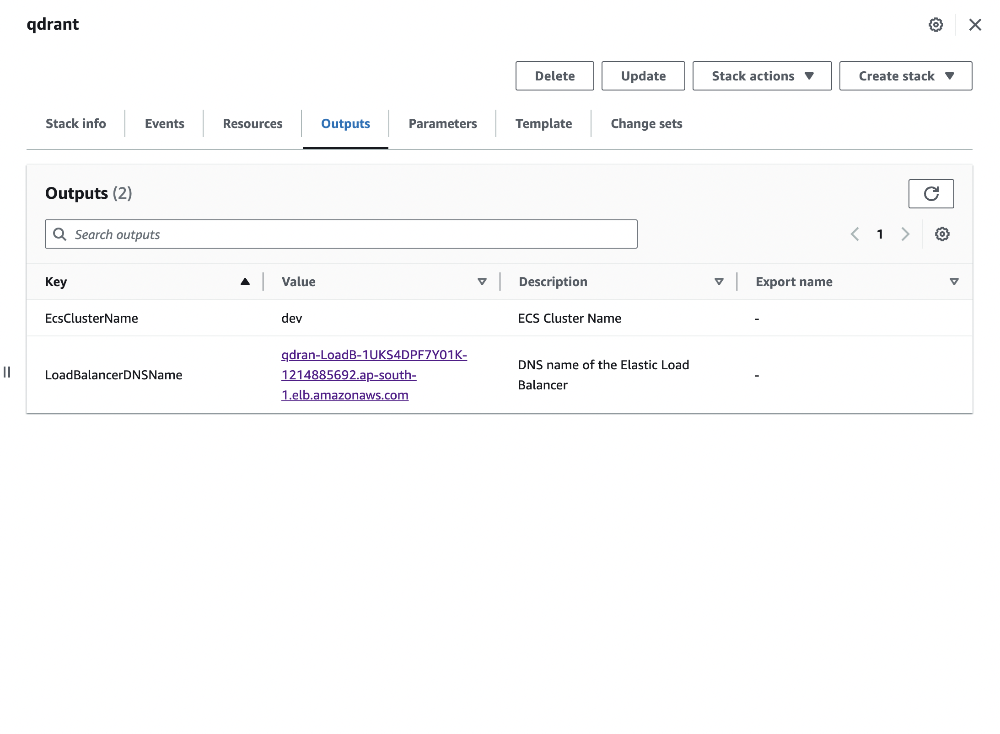
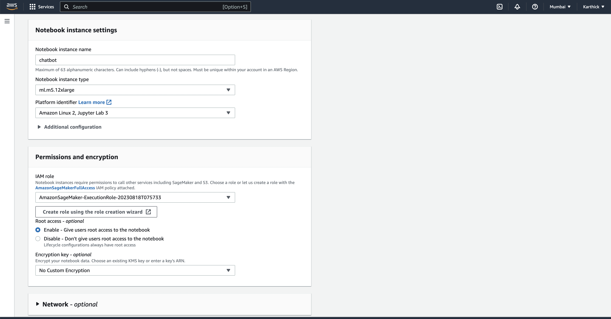

## Introduction

Creating an enterprise chatbot that answers questions using AI and large language models has become quite common. Amazon Lex offers a framework for building such chatbots. These pre-trained models perform well in tasks like summarization, text generation, and question answering across various subjects. However, they often struggle to give accurate answers or fail when facing unfamiliar content. This is because they lack exposure to data beyond their training.

To tackle this, a popular solution is Retrieval Augmented Generation (RAG). Here's how it works: First, the user's question is transformed into vector embeddings using a language model. These embeddings are then compared to a database of embeddings containing the enterprise's knowledge. A few similar documents are selected (usually around three), and along with the user's question, they are given as context to another language model. This second model generates an answer based on the provided context.

Now, let's explore how to build a Question Answering ChatBot using AWS SageMaker, Qdrant, and Langchain.

## What is Qdrant?

Qdrant is an open-source vector search engine that allows you to search for similar vectors in a large dataset. It can be used to store and retrieve information about your enterprise. For example, you can store information about your products, services, and policies. You can then use Qdrant to retrieve this information when a user asks a question.

## Prerequisites

- AWS Account
- Able to setup Envronment using our CloudFormation template

## Create the Qdrant DB with our CloudFormation template

We have created a CloudFormation template that will create the environment for you. You can find the template [here](./2.yaml).

1. Go to the CloudFormation console and click on Create Stack.

2. Select the Upload a template file from Template is Ready Option and choose the template file you downloaded.

3. Enter a name for the stack and check the Parameters section. You can change the default values if you want. We have provided the default values for the parameters and description in the yaml file.



# You need to have VPC and Subnets to create the environment. Choose from your existing VPC and Subnets or create new ones.


Attached the Screenshot of the Parameters section.





4. After you have entered the name and parameters, click on Next.

5. On the next page, you can add tags to your stack. Click on Next.

6. On the next page, you can review your stack. Click on Submit.

7. Wait for the stack to be created. It will take around 10 minutes.

After the stack is created, you can see the outputs. You will see a Url for the Qdrant DB. You can use this Url to access the Qdrant DB.
On hitting the URL in the browser, you will see something like this:

{
"title": "qdrant - vector search engine",
"version": "1.4.1"
}

Attached the Screenshot of the Outputs section.



## Deploy LLMs on AWS SageMaker

Amazon SageMaker provides a wide range of pre-trained models that can be used for various tasks.

Let's start by creating a SageMaker notebook instance. You can find the instructions [here](https://docs.aws.amazon.com/sagemaker/latest/dg/nbi.html).

After the notebook instance is created, open the notebook instance and click on Open JupyterLab.

Let's deploy Falcon 7B on SageMaker. Falcon 7B is a pre-trained model that can be used for question answering. You can find more information about Falcon 7B [here](https://huggingface.co/tiiuae/falcon-40b).

Create a new notebook and name it `deploy.ipynb` and paste the hugging face code in the notebook.

Make sure the Notebook instance can handle the model size. You can change the instance type in the notebook instance settings.

Here's the screenshot of the notebook instance settings.



Make sure you have the instance available. Otherwise, you can apply for the limit increase.

Once It's done running, The endpoint will be automatically created for you. You can use this endpoint name to make requests to the model.

You will get the endpoints inside the inference section of the notebook.

Attached the Screenshot of the inference section.


## Create a Lambda Function

Now, let's create a Lambda function that will be used to make requests to the SageMaker endpoint.

1. Go to the Lambda console and click on Create Function.

2. Enter a name for the function and select Python 3.8 as the runtime.

3. Click on Create Function.

4. Scroll down to the Function Code section and paste the following code:

   ```python
   import json
   import boto3
   import os
   import requests

   ENDPOINT_NAME = os.environ['ENDPOINT_NAME']

   def lambda_handler(event, context):
       client = boto3.client('sagemaker-runtime')
       response = client.invoke_endpoint(
           EndpointName=ENDPOINT_NAME,
           Body=json.dumps(event),
           ContentType='application/json',
           Accept='application/json'
       )
       return json.loads(response['Body'].read().decode())

1. Scroll down to the Environment Variables section and add the following environment variable:
2. ENDPOINT_NAME = <endpoint_name>
3. Click on Save.

Create an API Gateway

1. Now, let's create an API Gateway that will be used to make requests to the Lambda function.

2. Go to the API Gateway console and click on Create API.

3. Enter a name for the API and click on Create API.

4. Click on Actions and select Create Resource.

5. Enter a name for the resource and check the Enable API Gateway CORS option.

6. Click on Create Resource.

7. Click on Actions and select Create Method.

8. Select POST as the method and click on the checkmark.

9. Select Lambda Function as the integration type and check the Use Lambda Proxy integration option.

10. Select the region where you created the Lambda function and enter the name of the Lambda function.

11. Click on Save.

12. Click on Actions and select Deploy API.

13. Select [New Stage] as the Deployment stage and enter a name for the stage.

14. Click on Deploy.

15. Click on the Invoke URL to test the API.

## Inject Data into Qdrant DB

Now, let's inject some data into the Qdrant DB.

Our PDF ingestion process involves several steps, including extracting text from the PDF, breaking the text into manageable chunks, and creating embeddings for each chunk. These embeddings serve as the foundation for our ChatBot's understanding of the document.

Create a new notebook and name it ingest.ipynb and paste the code in the notebook.

sagemaker_client = boto3.client('sagemaker')
qdrant_client = QdrantClient(host="<QDRANT_HOSTNAME>")

# Ingest data into Qdrant
```
    import pdfplumber
    from qdrant_client import QdrantClient, PointStruct
    import boto3
    import json

    # Replace with your actual Qdrant hostname
    QDRANT_HOSTNAME = "<QDRANT_HOSTNAME>"
    # Replace with your actual SageMaker endpoint name
    SAGEMAKER_ENDPOINT_NAME = "<SAGEMAKER_ENDPOINT_NAME>"

    sagemaker_runtime = boto3.client('sagemaker-runtime')
    qdrant_client = QdrantClient(host=QDRANT_HOSTNAME)

    def compute_embeddings(text):
        # Replace with your actual embedding computation code
        embeddings = [0.1, 0.2, 0.3]  # Placeholder values
        return embeddings

    def ingest_data_into_qdrant_from_pdf(pdf_path):
        texts = []
        
        with pdfplumber.open(pdf_path) as pdf:
            for page in pdf.pages:
                text = page.extract_text()
                texts.append(text)
        
        points = []
        for idx, text in enumerate(texts):
            embeddings = compute_embeddings(text)
            points.append(PointStruct(id=idx, vector=embeddings, payload={"text": text}))
        
        operation_info = qdrant_client.upsert(
            collection_name="mycollection",
            wait=True,
            points=points
        )
        return operation_info

    def retrieve_similar_documents(query):
        similar_documents = qdrant_client.search(
            collection_name="mycollection",
            vectors=[compute_embeddings(query)],  # Replace with query embeddings
            top=3  # Retrieve the top 3 most similar documents
        )
        context = [document.payload['text'] for document in similar_documents]
        return context

    def process_user_query(query, context):
        input_data = {
            'context': context,
            'query': query
        }

        response = sagemaker_runtime.invoke_endpoint(
            EndpointName=SAGEMAKER_ENDPOINT_NAME,
            ContentType='application/json',
            Accept='application/json',
            Body=json.dumps(input_data)
        )
        result = json.loads(response['Body'].read().decode())
        return result['answer']
```
# User query
user_query = "Tell me about the benefits of renewable energy."

# Ingest data from PDF into Qdrant (replace with your PDF path)
pdf_path = "path/to/your/pdf/document.pdf"
ingest_data_info = ingest_data_into_qdrant_from_pdf(pdf_path)

# Retrieve context from Qdrant
context = retrieve_similar_documents(user_query)

# Process query using SageMaker model and context
response = process_user_query(user_query, context)

print("Ingestion Operation Info:", ingest_data_info)
print("ChatBot Response:", response)

```
# Retrieve similar documents from Qdrant and get context
```
def retrieve_similar_documents(query):
    similar_documents = qdrant_client.search(
        collection_name="mycollection",
        vectors=[compute_embeddings(query)],  # Replace with query embeddings
        top=3  # Retrieve the top 3 most similar documents
    )
    context = [document.payload['text'] for document in similar_documents]
    return context
```
# Process user query using SageMaker model and context
```
 def process_user_query(query, context):
    endpoint_name = "<SAGEMAKER_ENDPOINT_NAME>"
    sagemaker_runtime = boto3.client('sagemaker-runtime')

    input_data = {
        'context': context,
        'query': query
    }

    response = sagemaker_runtime.invoke_endpoint(
        EndpointName=endpoint_name,
        ContentType='application/json',
        Accept='application/json',
        Body=json.dumps(input_data)
    )
    result = json.loads(response['Body'].read().decode())
    return result['answer']
```
# User query
user_query = "Tell me about the benefits of renewable energy."

# Ingest data into Qdrant (assuming texts is a list of documents/texts)
texts = ["Renewable energy sources provide sustainable solutions..."]
ingest_data_info = ingest_data_into_qdrant(texts)

# Retrieve context from Qdrant
context = retrieve_similar_documents(user_query)

# Process query using SageMaker model and context

response = process_user_query(user_query, context)

print("ChatBot Response:", response)


Understanding the Process

Qdrant Setup: We initiate a connection to the Qdrant database using the provided hostname and API key.

Recreate Collection: If needed, we recreate the collection in Qdrant. This ensures that our ChatBot's knowledge base is up to date.

PDF Ingestion: We use the pdfplumber library to extract text from the PDF document. The extracted text is stored in the fulltext variable.

Chunking: To create manageable context chunks for our ChatBot, we break down the extracted text into smaller segments of approximately 500 characters each.

Creating Embeddings: For each chunk, we create embeddings (vector representations) and associate them with the original text. These embeddings serve as reference points for the Qdrant search engine. We then index these embeddings in Qdrant's collection.


## Interactive Question Answering with Streamlit App

Now, let's create a Streamlit app that will be used to interact with the ChatBot.

**User Interaction Workflow:**

1. A user accesses the Streamlit application hosted on AWS EC2.

2. The user inputs a question related to the enterprise's domain, products, or services.

3. The Streamlit app sends the user's question to our deployed SageMaker model via a REST API call.

4. The SageMaker model processes the question, retrieves context from Qdrant's indexed data, and generates an answer.

5. The answer is returned to the Streamlit app and displayed to the user in real time.

**Setting Up the Streamlit App:**

Streamlit is a fantastic tool that allows you to create interactive web applications with just a few lines of Python code. Here's how to set up the Streamlit app:

1. Install Streamlit:

   You can install Streamlit using the following command:

   ```bash
   pip install streamlit

1. Create a Python File for the Streamlit App:

Create a new Python file, such as app.py, and add the following code:

import streamlit as st
import requests
```
def get_answer(question):
    response = requests.post(
        url="<SAGEMAKER_REST_API_URL>",
        json={"text": question}
    )
    
    answer = response.json()["answer"]
    
    return answer

st.title("Question Answering ChatBot")
```
user_question = st.text_input("Ask a question:")
if st.button("Get Answer"):
    if user_question:
        answer = get_answer(user_question)
        st.write("Answer:", answer)
    else:
        st.write("Please enter a question.")

```
Replace <SAGEMAKER_REST_API_URL> with the actual REST API URL of your SageMaker model.

## Running the Streamlit App:

With the Streamlit app code ready, let's run it locally to see how our users will interact with the ChatBot:

Open a terminal and navigate to the directory where app.py is located.

Run the Streamlit app using the following command:

```
    streamlit run app.py


A new browser tab will open with your Streamlit app. Enter a question and click the "Get Answer" button to see the ChatBot's response.


Hosting the Streamlit App on AWS EC2:

To make your Streamlit app accessible to users online, you can host it on an AWS EC2 instance. Here's a brief overview of the steps:

Launch an EC2 Instance:

Launch an EC2 instance with a suitable configuration based on your expected traffic and requirements.

Configure Security Groups:

Configure the security group associated with your EC2 instance to allow incoming traffic on the Streamlit port (default is 8501).

Upload Your Code:

Upload your Streamlit app code and any required files to the EC2 instance.

Install Dependencies:

SSH into the EC2 instance and install the required dependencies, including Streamlit.

Start the Streamlit App:

Use the following command to start the Streamlit app on the EC2 instance:

```
```
  streamlit run app.py --server.port 80
```
## Conclusion

Congratulations! You have successfully built a powerful Question Answering ChatBot using AWS SageMaker, Qdrant, and Langchain. By leveraging advanced machine learning and search technologies, you've created a tool that can provide accurate answers to user queries. This not only enhances user interactions but also showcases the potential of AI-powered applications in real-world scenarios.

With the combination of AWS services and open-source tools, you've demonstrated how to overcome challenges and create innovative solutions. The possibilities for further enhancing and customizing your ChatBot are vast, and this foundation gives you a strong starting point for future projects.

Thank you for joining us on this journey of building an intelligent and interactive ChatBot. Happy coding and exploring the world of AI-powered applications!

## References

- https://aws.amazon.com/sagemaker/
- https://aws.amazon.com/ec2/
- https://aws.amazon.com/cloudformation/
- https://aws.amazon.com/lambda/
- https://aws.amazon.com/api-gateway/
- qdrant.tech